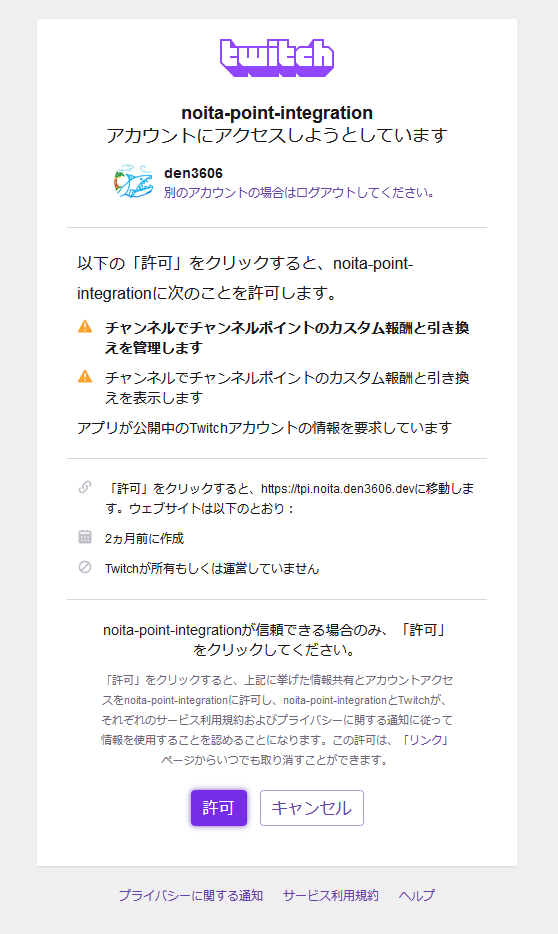

# Step1 Twitchアカウントの連携

## アプリに対して権限を許可する

Step1では、TwitchアカウントとTwitch Point Integrationの連携を行います。

[https://tpi.noita.den3606.dev/twitch/authorize](https://tpi.noita.den3606.dev/twitch/authorize)   
へアクセスすると、以下Twitchへログインしていない場合は以下のような画面が表示されます。ユーザー名とパスワードを入力し、ログインを完了させてください。

ログインが完了すると、次にTwitch Point Integrationで利用するTwitchのアクションを許可する画面が表示されます。
内容を確認し、許可する内容に問題がなければ、「許可」ボタンを押してください。

許可する内容が許容できない場合は「キャンセル」ボタンを押してください。
認可が拒否されたと判断され、連携作業が終了します。

キャンセルされた場合は、Twitch Point Integrationを利用できません。

認可が完了すると、Twitch Point Integrationとの連携完了ページへ遷移します。

完了ページのタブを閉じて、次のステップを実施してください。
