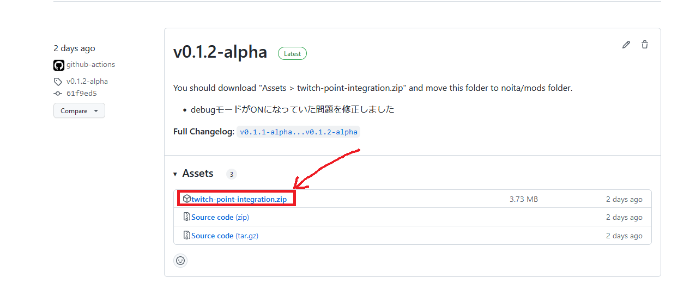
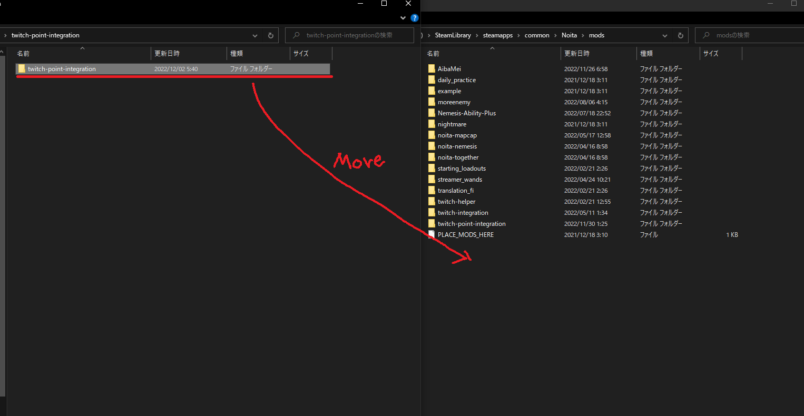
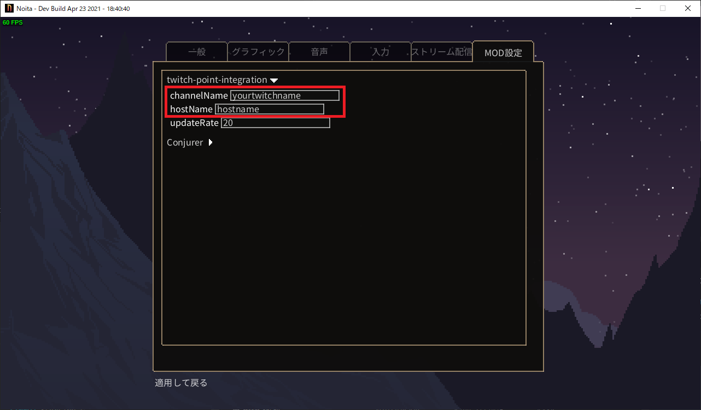

# Step2 MODのインストールとMODの設定

Step2では、Noita側のMOD設定を行います。

## MODを配置する

GitHubのReleasesページより、最新のソースコード `twitch-point-integration.zip` をダウンロードします。

[https://github.com/den3606/twitch-point-integration/releases](https://github.com/den3606/twitch-point-integration/releases)

ダウンロード後zipフォルダを解凍し、 `<Noitaがあるフォルダ>/Noita/mods/` 内に移動させます。

:::caution
フォルダ名は `twitch-point-integration` から変更しないでください！
MOD内でフォルダ名を参照しているため、正常に動作しなくなります。
:::

## MODの設定をする

フォルダの移しが完了した後、Noitaを起動します。Noita内のMOD設定にて、「twitch-point-integration」にチェックを入れてください。
MOD設定画面に移ると、「twitch-point-integration」の設定が行えるようになっているので、`channelName`, `hostName`の設定を行ってください。

基本的には以下のように入力すれば問題ありません。

|項目名|入力|
|:-:|:-:|
|channelName|自身のTwitchチャンネル名|
|hostName|tpiws.noita.den3606.dev|

:::tip
ご自身でTwitch Point Integration用のサーバーを用意した場合、hostNameにはwebsocket用のURIを設定してください。
:::

MOD設定が終わればStep2の作業は完了です。
次のステップを実施してください。
