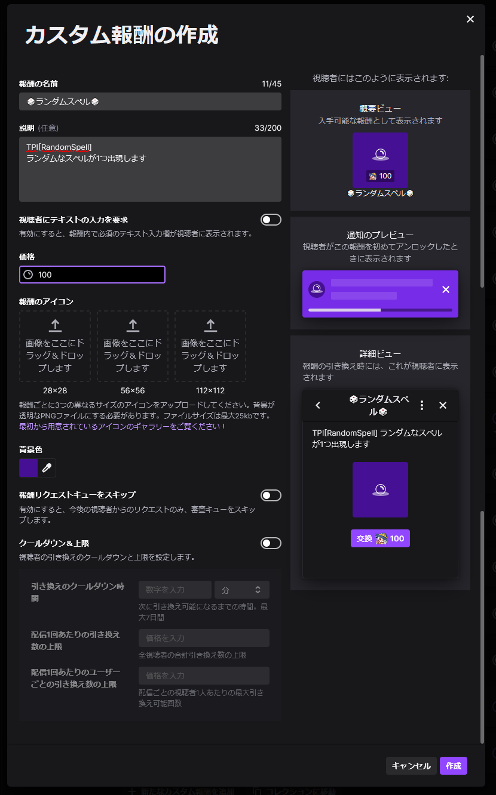
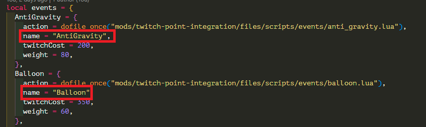

# Step3 Twitch側の設定

Step3では、Twitchにポイント報酬を登録します。

登録するイベントは、配信者側で自由に決めてください。  
配信者側に有利なイベントのみ登録してNoitaを簡単にしたり、
配信者側に不利なイベントのみ登録してNoitaを難しくすることもできます。

## カスタム報酬の登録

Twitchのクリエイターダッシュボード内にある、「視聴者向け報酬 > チャンネルポイント」からカスタム報酬を設定します。  
Twitch Point Integrationアプリ側では、

- ポイント報酬の値段
- ポイント報酬のクールタイム

等のTwitchポイント側の制御に関して、制御していないため自身で決定する必要があります。

:::note
より管理しやすい仕組みに変更する予定ですが、時期は未定です
:::

カスタム報酬の作成を選択すると、以下のようなモーダルが表示されます。

- 報酬の名前
- 価格
- 報酬リクエストキューをスキップ
- クールダウン＆上限

に関しては自由に設定しても問題ないですが、「説明」の項目には必ず

**TPI[<イベント名>]**

を入力してください。

例）TPI[AntiGravity]

上記のTPI設定さえしていれば、2行目以降には自由な文言を記載可能です。

## イベント名の探し方

[イベントリスト](../event-list.md)に掲載予定ですが、最新のものは掲載されていない可能性があります。

掲載されていないイベント名に関しては、 MODフォルダ内にあるデータを確認する必要があります。  
`twitch-point-integration/files/scripts/noita_event_observer.lua`ファイル内にeventリストの名前が記載されています。
それがイベント名となります。

以上でStep3に関しての作業も完了です。
最後のステップを実施してください。
