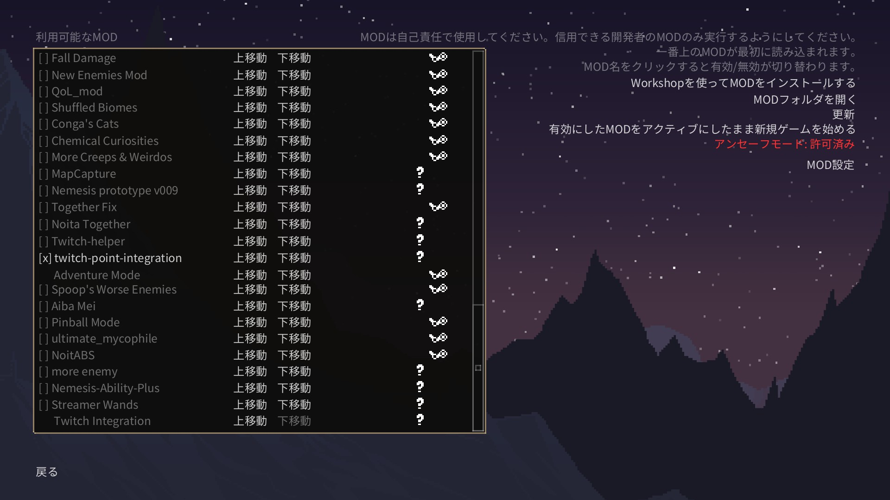
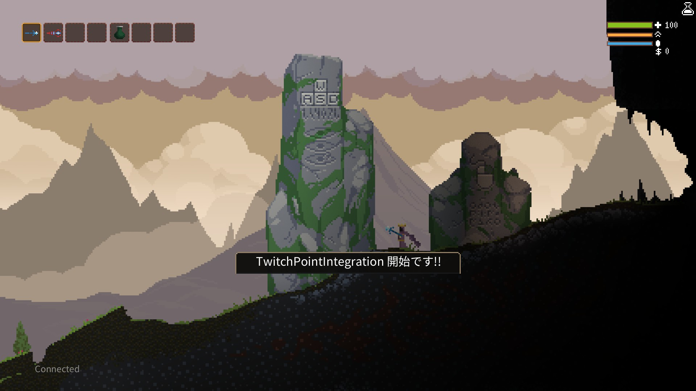

# Step4 動作確認

Step4では、実際にNoitaでカスタム報酬が反映されるかの確認を行います。

Noita起動後、MOD設定にて「twitch-point-integration」にチェックが入っていることを確認します。

チェックを入れたたまNoitaをスタートして、Twitch Point Integration開始のメッセージが表示されていれば、サーバーとの接続は完了です。

最後にTwitchのチャット欄からカスタム報酬を実行し、実際にイベントが動くかの確認をしてください。

イベントが動作すれば、連携完了です！  
MODを楽しんでください。
